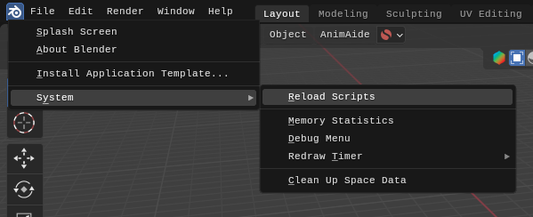
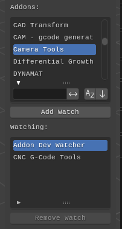

# WARNING

Tested with Blender 4.0.0 Beta, hash: `779239f5e180`.

# Blender Addon Dev Watcher

This addon auto-reloads the selected addons when file changes get detected for a fast development cycle.

It uses the Python [watchdog](https://github.com/gorakhargosh/watchdog) module.

## The Problem

Blender addon development is greatly slowed down due to lack of hot-reloading on file changes.

Some proposed workarounds include:

1. refresh followed by disabling/enabling the addon from the `Preferences... > Add-ons` panel
2. using the `Reload Scripts` button

Both of these are horrible to work with.

## The Solution

This addon found under the `View 3D > Sidebar > Tool > Addon Dev Watcher` panel lists the available (user) addons in the top list apart from itself.

We can add any addon from the top list to the bottom list with the `Add Watch` button. This starts a `watchdog` process waiting for file changes in the respective addon. When such a file change is detected it auto-reloads that addon.

To remove an addon from the watch list use the `Remove Watch` button.

That's it, nice and simple.

## Notes

For now, there are no preference and the addon resets every time Blender is restart. This means that you have to actively add an addon to the watched list every restart.

The addon adds itself to the watch list and can't be unwatched. This is so we can hot-reload it during development at any time for whatever reason.

Refreshing the addon is done with the help of the `bpy.ops.preferences.addon_disable()`, `bpy.ops.preferences.addon_enable()` Blender function, and a solution to recursively reload modules from [this gist](https://gist.github.com/KristianHolsheimer/f139646259056c1dffbf79169f84c5de).
